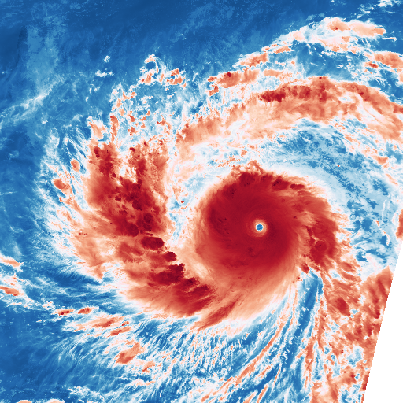
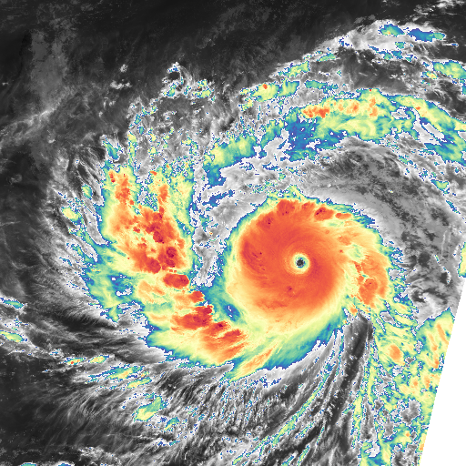
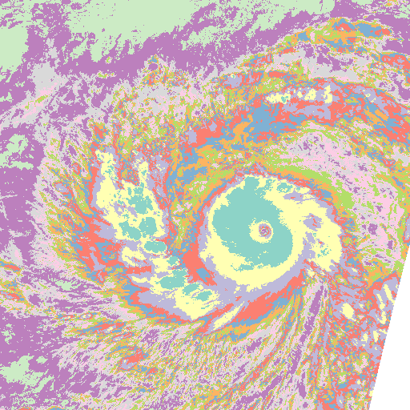

==========
 Colormap
==========

Example usage
=============

A simple example of applying a colormap on data::

    from trollimage.colormap import rdbu
    from trollimage.image import Image

    img = Image(data, mode="L")

    rdbu.set_range(-90 + 273.15, 30 + 273.15)
    img.colorize(rdbu)

    img.show()

A more complex example, with a colormap build from greyscale on one end, and spectral on the other, like this:

.. image:: _static/my_cm.png

::

    from trollimage.colormap import spectral, greys
    from trollimage.image import Image

    img = Image(data, mode="L")

    greys.set_range(-40 + 273.15, 30 + 273.15)
    spectral.set_range(-90 + 273.15, -40.00001 + 273.15)
    my_cm = spectral + greys
    img.colorize(my_cm)

    img.show()

Now applying a palette to the data, with sharp edges::

    from trollimage.colormap import set3
    from trollimage.image import Image

    img = Image(data, mode="L")

    set3.set_range(-90 + 273.15, 30 + 273.15)
    img.palettize(set3)

    img.show()

API
===

See the :class:`~trollimage.Colormap` API documentation.

Default Colormaps
=================

Colors from www.ColorBrewer.org by Cynthia A. Brewer, Geography, Pennsylvania State University.

Sequential Colormaps
~~~~~~~~~~~~~~~~~~~~

.. trollimage_colormap:: trollimage.colormap.sequential_colormaps

Diverging Colormaps
~~~~~~~~~~~~~~~~~~~

.. trollimage_colormap:: trollimage.colormap.diverging_colormaps

Qualitative Colormaps
~~~~~~~~~~~~~~~~~~~~~

.. trollimage_colormap:: trollimage.colormap.qualitative_colormaps
   :category:

Rainbow Colormap
~~~~~~~~~~~~~~~~

Don't use this one ! See here_ and there_ why

.. _here: https://www.nature.com/articles/s41467-020-19160-7
.. _there: https://doi.org/10.1109/MCG.2007.323435

.. trollimage_colormap:: trollimage.colormap.rainbow
